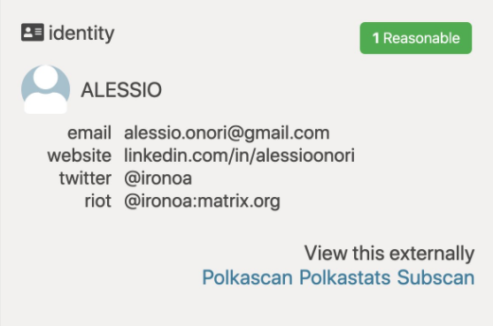
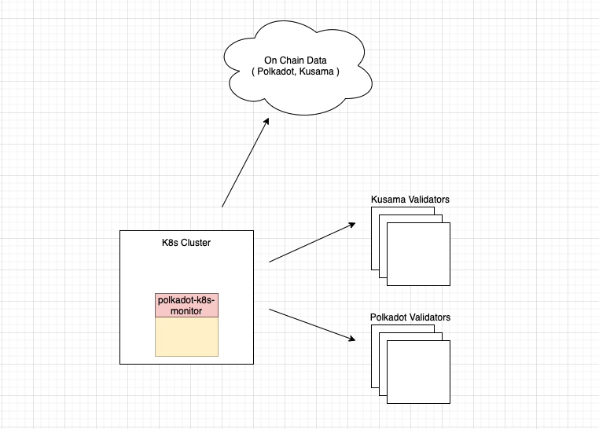
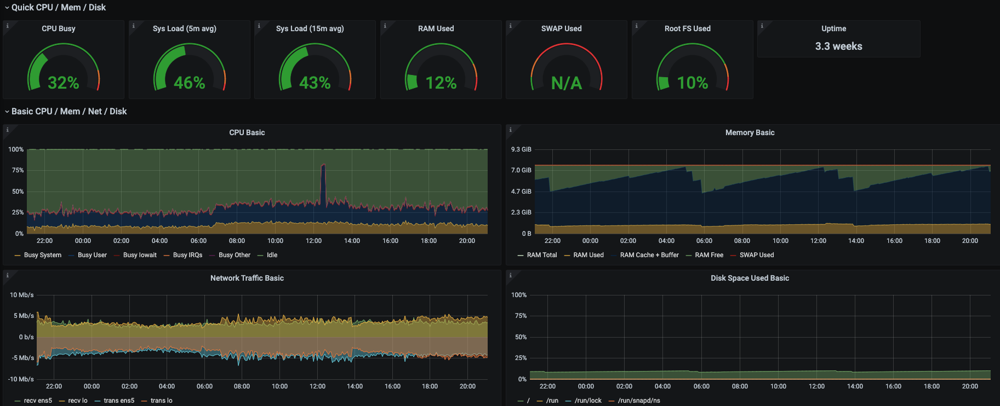
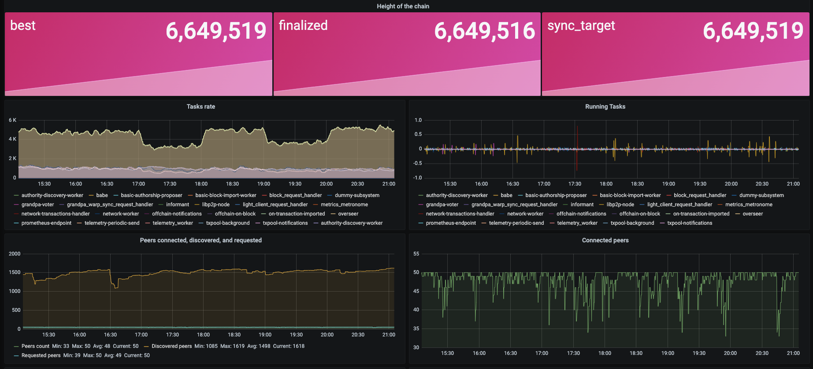
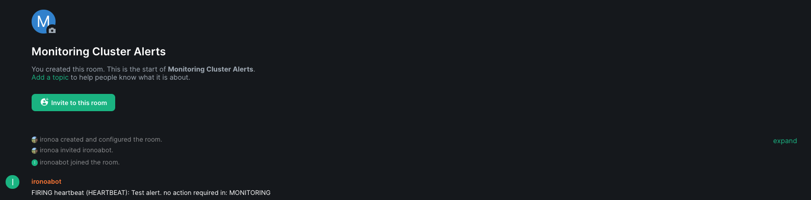
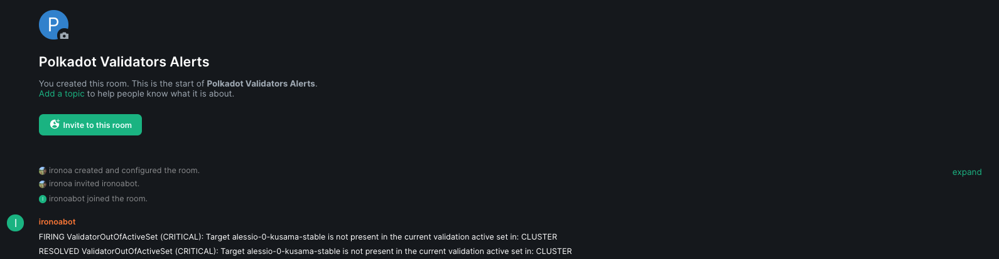

# Polkadot-K8s-Monitor

A tool to deploy a Monitoring System for your Substrate based Nodes in a Kubernetes cluster. The focus is specific on Validators.

## My on-chain Identity

ALESSIO (Validator on Polkadot): 16cdSZUq7kxq6mtoVMWmYXo62FnNGT9jzWjVRUg87CpL9pxP  
ALESSIO (Validator on Kusama): GaK38GT7LmgCpRSTRdDC2LeiMaV9TJmx8NmQcb9L3cJ3fyX




## Application Architecture



## Youtube

* [Tutorial: Local Deployment](https://www.youtube.com/watch?v=6WdcC6o49QI)

## Table Of Contents

* [Requirements](#requirements)
* [Polkadot Secure Validator](#polkadot-secure-validator)
* [How To Configure the Application](#how-to-configure-the-application)
* [How To Deploy it Locally](#how-to-deploy-it-locally)
* [How To Deploy it in Production](#how-to-deploy-it-in-production)
* [How it will look like](#how-it-will-look-like)
* [Future Developments](#future-developments)

## Requirements
* kind (if you want to deploy it locally): https://kind.sigs.k8s.io/docs/user/quick-start/#installation
* kind requires Docker: https://docs.docker.com/get-docker/
* A Kubernetes cluster (if you don't want to use kind)
* kubectl: https://kubernetes.io/docs/tasks/tools/
* helmfile: https://github.com/roboll/helmfile#installation => brew install helmfile (on macOS)

## Polkadot Secure Validator
This project is particularly suited to be working in synergy with the polkadot-secure-validator, the official node deployment tool from Web3 Foundation: https://github.com/w3f/polkadot-secure-validator 

## How To Configure the Application

You can find a sample of the nodes related yaml config file [here](config/nodes.sample.yaml).  

```yaml
validatorsPolkadot:
- name: polkadot-node-0
  stashAccount: YourPolkadotStashAddress
  ip: x.x.x.x   
validatorsKusama: 
- name: kusama-node-0
  stashAccount: YourKusamaStashAddress
  ip: x.x.x.x 
```

You can find two samples of the environment variables related files, meant to contain also your secrets and your passwords:  
* the complete configuration [file](config/env.sample.complete.sh), production ready  
* the local configuration [file](config/env.sample.local.sh), ready to be deployed into a local kind cluster  

```sh
export GRAFANA_PASSWORD="xxx" #Optional: default "admin"

export VALIDATOR_HTTP_AUTH_USER='xxx' #Optional: default "prometheus"
export VALIDATOR_HTTP_AUTH_PASSWORD='xxx' #Optional: default "nginx_password"

#### Optional: if you want the Matrix/Riot notifications working #####
export KUSAMA_VALIDATOR_MATRIXBOT_USER='@xxx:matrix.org'
export KUSAMA_VALIDATOR_MATRIXBOT_PASSWORD='xxx'
export KUSAMA_VALIDATOR_MATRIXBOT_ROOM_ID='!xxx:matrix.org'

export POLKADOT_VALIDATOR_MATRIXBOT_USER='@xxx:matrix.org'
export POLKADOT_VALIDATOR_MATRIXBOT_PASSWORD='xxx'
export POLKADOT_VALIDATOR_MATRIXBOT_ROOM_ID='!xxx:matrix.org'

export MATRIXBOT_USER='@xxx:matrix.org'
export MATRIXBOT_PASSWORD='xxx'
export MATRIXBOT_ROOM_ID='!xxx:matrix.org'
######################################################################
```

## How To Deploy it Locally
I'd reccomend to test first this approach 

```bash
git clone https://github.com/w3f/polkadot-k8s-monitor.git
cd polkadot-k8s-monitor
cp config/env.sample.local.sh config/env.sh #create the default env config file
cp config/nodes.sample.yaml config/nodes.yaml #create the default nodes config file
#just the fist time

./scripts/deployLocal.sh
# just re trigger it to deploy configuration changes

#if you want to delete your local cluster
#./scripts/uninstallLocal.sh
```

## How To Deploy it in Production
First, connect yourself to your chosen kubernetes cluster.

```bash
git clone https://github.com/w3f/polkadot-k8s-monitor.git
cd polkadot-k8s-monitor
cp config/env.sample.complete.sh config/env.sh #create the default env config file
cp config/nodes.sample.yaml config/nodes.yaml #create the default nodes config file
#just the fist time

./scripts/deployProduction.sh
# just re trigger it to deploy configuration changes
```

## How it will look like





## Future Developments
- [ ] Improve the documentation
- [X] Youtube tutorials 
