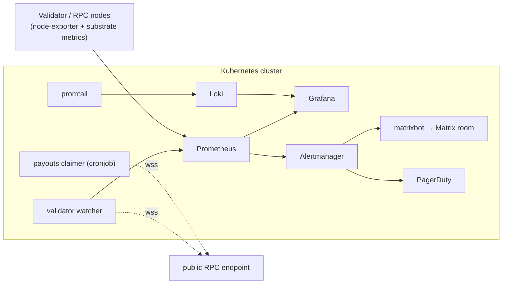
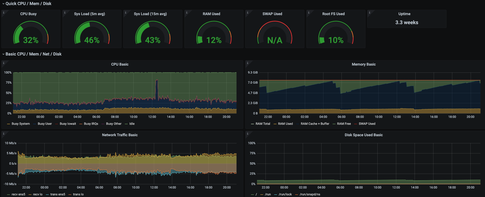
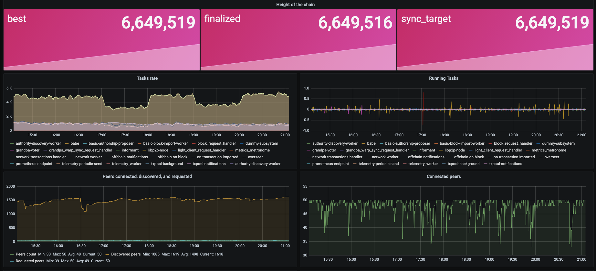
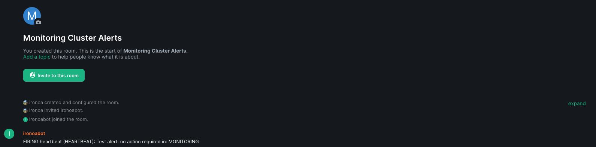
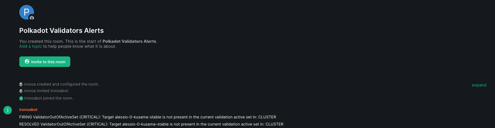

# Polkadot-K8s-Monitor

A tool to deploy a monitoring system for your Substrate-based nodes in a Kubernetes
cluster, with a specific focus on validators: Prometheus + Grafana + Loki, validator
watcher, payout claimer, alert routing to Matrix and PagerDuty — all managed
declaratively with helmfile.


```mermaid
flowchart LR
    subgraph cluster["Kubernetes cluster"]
        prom["Prometheus"] --> graf["Grafana"]
        prom --> am["Alertmanager"]
        watcher["validator watcher"] --> prom
        promtail["promtail"] --> loki["Loki"] --> graf
        am --> matrix["matrixbot → Matrix room"]
        am --> pd["PagerDuty"]
        claimer["payouts claimer (cronjob)"]
    end
    nodes["Validator / RPC nodes<br>(node-exporter + substrate metrics)"] --> prom
    watcher -.->|wss| chain["public RPC endpoint"]
    claimer -.->|wss| chain
```

## Related Projects

- [w3f/polkadot-k8s-payouts](https://github.com/w3f/polkadot-k8s-payouts) — the payout claimer deployed by this stack
- [ironoa/polkadot-watcher-validator](https://github.com/ironoa/polkadot-watcher-validator) — the validator watcher app deployed by this stack

## Table Of Contents

* [Requirements](#requirements)
* [How To Configure the Application](#how-to-configure-the-application)
* [How To Deploy it Locally](#how-to-deploy-it-locally)
* [How To Deploy it in Production](#how-to-deploy-it-in-production)
* [How it will look like](#how-it-will-look-like)
* [Troubleshooting](#troubleshooting)

## Requirements

* A Kubernetes cluster, or [kind](https://kind.sigs.k8s.io/docs/user/quick-start/#installation) (+ [Docker](https://docs.docker.com/get-docker/)) for a local deployment
* [kubectl](https://kubernetes.io/docs/tasks/tools/)
* [helmfile](https://github.com/helmfile/helmfile) => `brew install helmfile` (on macOS)

## How To Configure the Application

Two yaml config files describe what to monitor:
* [config/nodes.sample.yaml](config/nodes.sample.yaml) — the machines to scrape (node-exporter + substrate metrics)
* [config/validators.sample.yaml](config/validators.sample.yaml) — the stash accounts the watcher and the claimer act on

```yaml
# config/nodes.yaml
nodes:
- name: kusama-node-0
  ip: x.x.x.x
  nodeExporterPort: 9100 #Optional
  validatorMetricsPort: 9616 #Optional

# config/validators.yaml
validatorsKusama:
- name: kusama-validator-0
  stashAccount: YourKusamaStashAddress
```

You can find two samples of the environment variables related files, meant to contain also your secrets and your passwords:
* the complete configuration [file](config/env.sample.complete.sh), production ready
* the local configuration [file](config/env.sample.local.sh), ready to be deployed into a local kind cluster

```sh
export GRAFANA_PASSWORD="xxx" #Optional: default "admin"

export VALIDATOR_HTTP_AUTH_USER='xxx' #Optional: default "prometheus"
export VALIDATOR_HTTP_AUTH_PASSWORD='xxx' #Optional: default "nginx_password"

#### Optional: if you want the Matrix/Riot notifications working #####
export KUSAMA_VALIDATOR_MATRIXBOT_USER='@xxx:matrix.org'
export KUSAMA_VALIDATOR_MATRIXBOT_PASSWORD='xxx'
export KUSAMA_VALIDATOR_MATRIXBOT_ROOM_ID='!xxx:matrix.org'

export MATRIXBOT_USER='@xxx:matrix.org'
export MATRIXBOT_PASSWORD='xxx'
export MATRIXBOT_ROOM_ID='!xxx:matrix.org'
######################################################################
```

## How To Deploy it Locally

I'd recommend to test first this approach

```bash
git clone git@github.com:ironoa/polkadot-k8s-monitor.git
cd polkadot-k8s-monitor
cp config/env.sample.local.sh config/env.sh #create the default env config file
cp config/nodes.sample.yaml config/nodes.yaml
cp config/validators.sample.yaml config/validators.yaml
#just the first time

./scripts/deployLocal.sh
# just re trigger it to deploy configuration changes
```

To delete the local cluster: `./scripts/uninstallLocal.sh`

## How To Deploy it in Production

First, connect yourself to your chosen kubernetes cluster (the deploy targets the
**current kubectl context** — the script prints it before acting).

```bash
git clone git@github.com:ironoa/polkadot-k8s-monitor.git
cd polkadot-k8s-monitor
cp config/env.sample.complete.sh config/env.sh #create the default env config file
cp config/nodes.sample.yaml config/nodes.yaml
cp config/validators.sample.yaml config/validators.yaml
#just the first time

./scripts/deployProduction.sh          # sync the whole stack (helmfile.d)
./scripts/deployProduction.sh 60 70    # sync only helmfile.d/60-*.yaml and 70-*.yaml
./scripts/deployProduction.sh pre      # sync helmfile.pre.d (cert-manager)
```

## How it will look like






## Troubleshooting

- Prometheus major upgrades: [upgrading an existing kube-prometheus-stack release](https://github.com/prometheus-community/helm-charts/tree/main/charts/kube-prometheus-stack#upgrading-an-existing-release-to-a-new-major-version) — CRDs must be applied manually between chart majors
- Loki major upgrades: schema changes require a future-dated `schemaConfig` entry, never edit past entries ([storage schema docs](https://grafana.com/docs/loki/latest/operations/storage/schema/))
